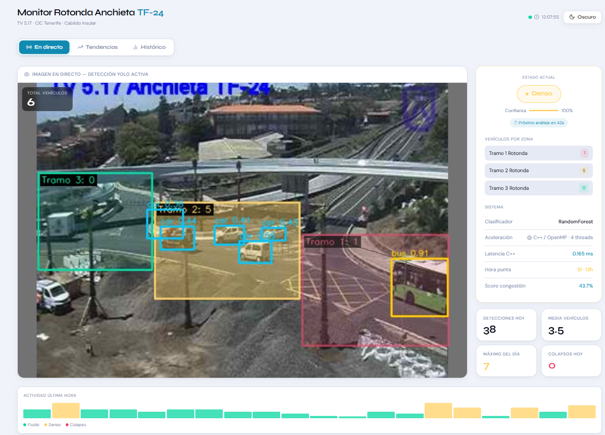
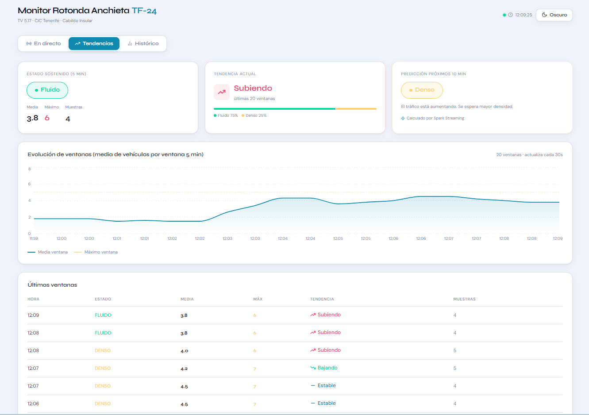
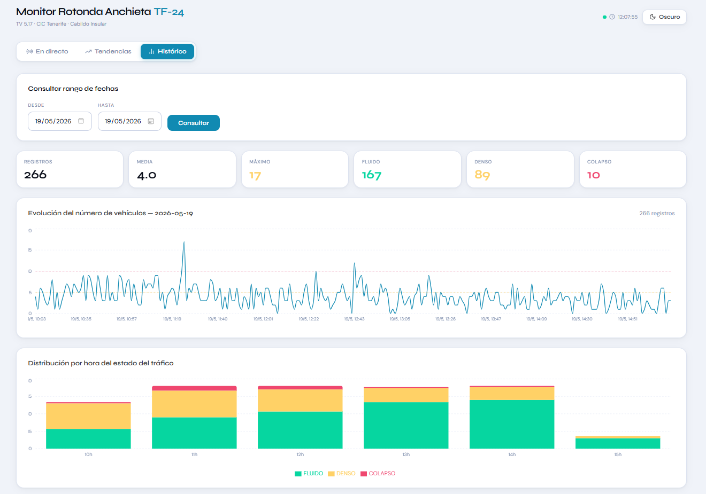

# Monitor Rotonda Anchieta TF-24

Sistema de monitorización de tráfico en tiempo real sobre la **Rotonda del Padre Anchieta TF-24** (TV 5.17, La Laguna, Tenerife), desarrollado como proyecto final de la asignatura **Computación en la Nube** del Máster en Ingeniería Informática de la Universidad de La Laguna.

---

## Motivación

La Rotonda del Padre Anchieta, punto de confluencia de la TF-5 y la TF-24, ha sido históricamente uno de los focos de congestión más críticos de Tenerife. Sus once pasos de peatones en superficie interrumpían continuamente el flujo rodado, generando colapsos recurrentes especialmente en hora punta. El 18 de mayo de 2026 se inauguró oficialmente la pasarela peatonal elevada que elimina estos cruces, y este sistema arrancó en producción al día siguiente — permitiendo monitorizar en tiempo real si la obra ha supuesto una mejora real del tráfico.

El dataset de entrenamiento fue capturado con la pasarela aún cerrada, lo que permite comparar los patrones históricos con el comportamiento post-apertura.

---

## Capturas del dashboard

### En directo


### Tendencias (Spark Streaming)


### Histórico


---

## Arquitectura

El sistema se organiza en cuatro contenedores Docker orquestados con Docker Compose:

```
CIC Tenerife (cámara TV 5.17)
        │ JPEG / 45s
        ▼
┌───────────────────┐     TCP :9999      ┌──────────────────┐
│     backend       │ ─────────────────▶ │      spark       │
│  Flask + YOLOv8s  │                    │  Streaming +     │
│  C++ / OpenMP     │                    │  MLlib           │
│  RandomForest     │                    └────────┬─────────┘
└───────┬───────────┘                             │
        │ REST + SSE              SQL             │ SQL
        │ ◀──────────────┐        ▼               ▼
        │            ┌───────────────────────────────┐
        │            │         PostgreSQL             │
        │            │    detecciones / ventanas      │
        │            └───────────────────────────────┘
        ▼
┌───────────────────┐
│     frontend      │
│  React + Vite     │
└───────────────────┘
```

---

## Componentes

### `backend` — Flask + YOLOv8s + C++/OpenMP

- Descarga frames de la cámara CIC cada 45 segundos (hash MD5 para evitar reprocesamiento).
- Detecta vehículos con **YOLOv8 small** sobre el frame enmascarado y los asigna a 3 ROIs.
- Cuenta los *bounding boxes* por ROI con un **binario C++ compilado con OpenMP** (`cpp/roi_counter`).
- Clasifica el estado del tráfico (FLUIDO / DENSO / COLAPSO) con un **RandomForest de 22 features** entrenado con Spark MLlib (accuracy 90%).
- Expone una API REST + **Server-Sent Events** para el frontend.
- Envía alertas por **Telegram** con imagen anotada cuando se detecta un nuevo COLAPSO.

### `spark` — Spark Streaming + MLlib

- Recibe eventos del backend vía socket TCP en micro-batches de 30 segundos.
- Calcula media, máximo y tendencia sobre una **ventana deslizante de 5 minutos**.
- Clasifica el estado con el modelo RandomForest exportado.
- Persiste cada ventana en PostgreSQL (`spark_ventanas`).
- Latencia medida en producción: **30,0 s ± 0,1 s** sobre 1.664 ventanas.

### `frontend` — React + Vite

Tres pestañas:
- **En directo**: frame anotado con ROIs coloreadas, contador superpuesto, estado, conteos por zona, métricas del pipeline (C++/OpenMP, latencia, threads) y countdown al próximo análisis.
- **Tendencias**: datos de Spark Streaming — estado sostenido, tendencia actual, predicción próximos 10 min, gráfico de evolución y tabla de últimas ventanas.
- **Histórico**: consulta por rango de fechas con estadísticas, gráfico temporal y distribución por hora.

### `postgres` — PostgreSQL 16

Dos tablas principales:
- `detecciones`: un registro por frame procesado (timestamp, conteo, estado, features visuales).
- `spark_ventanas`: agregados por ventana Spark (media, máximo, tendencia, estado predicho).

---

## Modelo de clasificación

El clasificador RandomForest se entrenó en **5 iteraciones** con Spark MLlib:

| It. | Datos | Features | Accuracy | F1 |
|-----|-------|----------|----------|----|
| 1 | 3 días · sin `vehicle_count` | 19 | 64,1% | 0,56 |
| 2 | 5 días · sin `vehicle_count` | 19 | 81,6% | 0,78 |
| 3 | 6 días · +`vehicle_count` | 20 | 84,7% | 0,85 |
| 4 | 6 días · nuevo día de test | 20 | 79,0% | 0,78 |
| 5 | 7 días · +`congestion_score`, +`is_peak_hour` | 22 | **90,0%** | **0,90** |

**Feature más importante**: `vehicle_count` (importancia 0,27), seguida de `edge_density` por ROI.

Para reentrenar:

```bash
docker exec rotonda_spark \
  /opt/spark/bin/spark-submit \
    --master local[*] \
    --driver-memory 6g \
    /opt/spark_jobs/train_spark.py
docker compose restart backend
```

---

## Rendimiento

| Componente | Tiempo típico | Peso en pipeline |
|------------|--------------|-----------------|
| Fetch (red CIC) | 253–289 ms | 63,6% |
| YOLO inference (CPU) | 94–1.459 ms | 25,2% |
| Clasificador RF | 32–56 ms | 11,1% |
| C++ OpenMP | ~0,15 ms | <0,1% |
| Spark ventana | 30,0 s ± 0,1 s | asíncrono |

El cuello de botella es la red, no el cómputo. Ver análisis completo en `performance/README.md`.

---

## Zonas de análisis (ROIs)

Tres zonas calibradas sobre el espacio 640×480 px con `tools/roi_selector.py`:

| Zona | Color en frame |
|------|---------------|
| Tramo 1 Rotonda | Rosa (`#ef476f`) |
| Tramo 2 Rotonda | Amarillo (`#ffd166`) |
| Tramo 3 Rotonda | Esmeralda (`#06d6a0`) |

---

## Arranque

```bash
# 1. Configura las variables de entorno
cp .env.example .env   # añade TELEGRAM_TOKEN y TELEGRAM_CHAT_ID si quieres alertas

# 2. Construye e inicia todos los contenedores
docker compose up --build

# 3. Dashboard
http://localhost:3000

# 4. API backend
http://localhost:5000/api/health

# 5. Spark UI
http://localhost:4040
```

### Variables de entorno

| Variable | Descripción | Default |
|----------|-------------|---------|
| `TELEGRAM_TOKEN` | Token del bot de Telegram | (vacío) |
| `TELEGRAM_CHAT_ID` | Chat ID para las alertas | (vacío) |
| `FETCH_INTERVAL` | Segundos entre capturas | 45 |
| `OMP_NUM_THREADS` | Threads OpenMP del binario C++ | 4 |

### Recompilar el binario C++ manualmente

```bash
docker exec rotonda_backend \
  g++ -O2 -fopenmp -o /app/cpp/roi_counter /app/cpp/roi_counter.cpp
```

---

## Estructura del proyecto

```
.
├── backend/
│   ├── cpp/                   # Binario C++ con OpenMP (roi_counter)
│   ├── models/                # YOLOv8s, RandomForest, label encoder
│   ├── routes/                # Endpoints Flask: status, frame, history, events, spark
│   └── services/              # Lógica: camera, detector, classifier, scheduler, telegram
├── spark/
│   ├── streaming_job.py       # Job Spark Streaming + ventana 5 min
│   └── train_spark.py         # Entrenamiento MLlib + exportación sklearn
├── frontend/
│   └── src/                   # React: App, TabLive, TabTendencias, TabHistorico, tokens
├── postgres/
│   └── init.sql               # Schema inicial
├── tools/                     # roi_selector, mask_selector, etiquetador, yolo_preview
├── performance/
│   └── Memoria_descriptiva_del_proyecto              # Análisis de rendimiento OpenMP, Spark, end-to-end
├── docs/                      # Capturas del dashboard
└── docker-compose.yml
```

---

## Tecnologías

| Componente | Tecnología |
|------------|-----------|
| Detección | YOLOv8 small (Ultralytics), OpenCV |
| Paralelismo | C++ + OpenMP (`#pragma omp parallel for`) |
| Backend | Python 3.11, Flask, Gunicorn + gevent, APScheduler |
| Streaming | Apache Spark 3.5, Spark Streaming |
| ML | Spark MLlib — RandomForest, CrossValidator 5-fold |
| Frontend | React 18, Vite, Recharts |
| Base de datos | PostgreSQL 16 |
| Infraestructura | Docker, Docker Compose |
| Alertas | Telegram Bot API |
| Fuente de datos | CIC Tenerife — Cabildo Insular de Tenerife |

---

## Fuente de datos

Cámara pública **TV 5.17 Anchieta TF-24** del Centro de Información de Carreteras (CIC):

```
https://cic.tenerife.es/e-Traffic3/data/camara-2701002-517.jpg
```